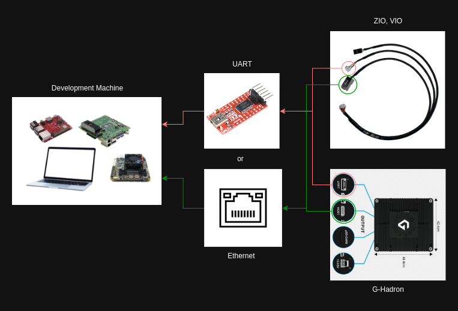

# PayloadSdk
This repo is officially SDK for all Gremsy's Payloads

## Hardware
- Ubuntu PC (x86_64)
- Jetson platform (aarch64)
- Raspberry Pi
- Qualcomm RB5165

## Software
This branch supported:
- Vio payload: software v2.0.0 or higher
- Zio payload: not supported yet
- GHardron payload: not supported yet
- OrusL payload: software v2.0.0 or higher

## Clone the project 
```
git clone -b payloadsdk_v3 https://github.com/Gremsy/PayloadSdk.git
```

## Hardware setup
PayloadSDK supports 2 control conections, that's configured at payloadsdk.h:



**Figure 1:** Hardware setup use Ethernet or UART connection

## How to build
- Install required lib
```
sudo apt-get install libcurl4-openssl-dev libjsoncpp-dev
sudo apt-get install libgstreamer1.0-dev libgstreamer-plugins-base1.0-dev
```

- Build project
<pre>
cd PayloadSdk
mkdir build && cd build

cmake -D<b>payload</b> ../
<i>e.g. cmake -DVIO=1 ../</i>
<i>     cmake -DGHADRON=1 ../</i>
<i>     cmake -DZIO=1 ../</i>

make -j6

</pre>
