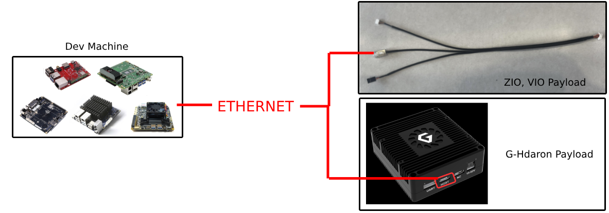
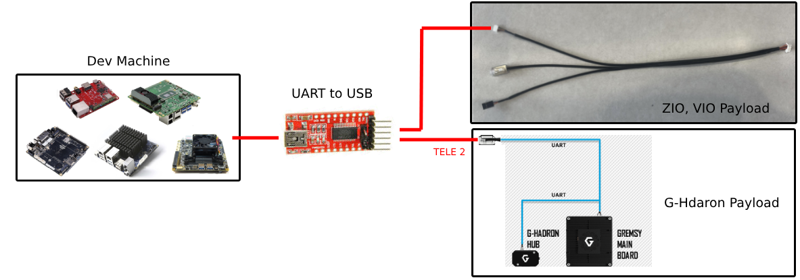

# PayloadSdk
This repo is officially SDK for all Gremsy's Payloads

## Hardware
- Ubuntu PC (x86_64)
- Jetson platform (aarch64)
- Raspberry Pi (developing)

## Clone the project 
```
git clone -b develop --recurse-submodules https://github.com/Gremsy/PayloadSdk.git

cd PayloadSdk/libs/gSDK/
git checkout gSDK_V3_alpha
git pull origin gSDK_V3_alpha
```

## Hardware setup
PayloadSDK supports 2 Control method, that's configured at payloadsdk.h:
- UDP - ETHERNET

Hardware Setup connect Ethernet

- UART PORT

Hardware Setup connect UART

## How to build
- Install required lib
```
sudo apt-get install libcurl4-openssl-dev libjsoncpp-dev
```

- Build project
<pre>
cd PayloadSdk
mkdir build && cd build

cmake -D<b>payload</b> ../
<i>e.g. cmake -DVIO=1 ../</i>
<i>     cmake -DGHADRON=1 ../</i>
<i>     cmake -DZIO=1 ../</i>

make -j6

</pre>
