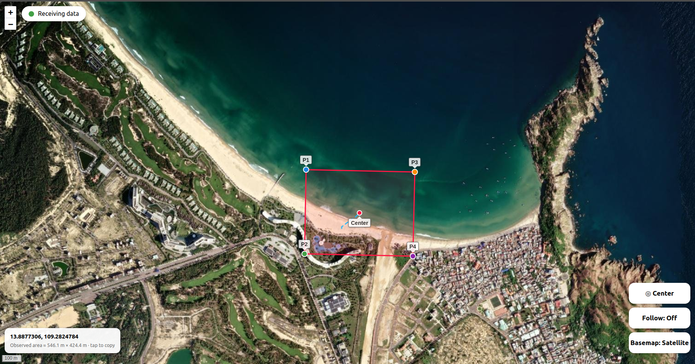
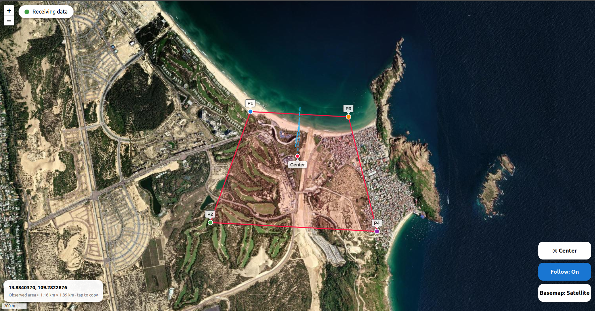

# KLV Footprint Map

Parses KLV stream metadata and shows the camera GPS footprint on a map.
Includes a GPS simulator for testing indoors without a GPS signal.

## Requirements

```bash
sudo apt install -y python3 python3-pip
pip3 install flask
```

## Connection Configuration

Edit `payloadsdk.h` to configure your connection:

```c
// Ethernet connection (default)
#define udp_ip_target "192.168.55.1"
#define udp_port_target 14566

// Or UART connection
#define uart_target "/dev/ttyUSB0"
#define uart_baud_target 115200
```

## Build

```bash
cd PayloadSdk
mkdir build
cd build

cmake -DMB1=1 ../
make -j$(nproc)
```

## Run

### 1. KLV parser

In another terminal:

```bash
cd PayloadSdk/build
./tests/parse_klv_stream/Test_Decode_KLV
```

It decodes the KLV stream and starts a GPS simulator. Default position: lat `10.836414`, lon `106.713832`, alt `30` m.

| Option | Description |
|---|---|
| `<lat> <lon> [alt]` | Start at this position. Alt in meters. |
| `--lat` `--lon` `--alt` | Set only the chosen fields. The others keep the default. |
| `--no-gps` | Do not start the simulator. Use it when a real GPS is connected to the payload. |

```bash
./tests/parse_klv_stream/Test_Decode_KLV                        # default position
./tests/parse_klv_stream/Test_Decode_KLV 21.03 105.85 50        # start at lat lon alt
./tests/parse_klv_stream/Test_Decode_KLV --alt 50               # change only the altitude
./tests/parse_klv_stream/Test_Decode_KLV --no-gps               # no simulator
GAPP_LOG_LEVEL=LOG_DEBUG ./tests/parse_klv_stream/Test_Decode_KLV   # debug log
```

### 2. Map viewer

Opens the browser at `http://127.0.0.1:5000`.

```bash
cd PayloadSdk
python3 tests/parse_klv_stream/map_viewer/map_viewer_app.py
```


### 3. Change the position while running

Type a command in the terminal of the KLV parser:

| Command | Description |
|---|---|
| `gps <lat> <lon> [alt]` | Set the position, e.g. `gps 10.83 106.71 30` |
| `gps --lat <v> --lon <v> --alt <v>` | Set only the chosen fields |
| `gps` | Print the current position |
| `help` / `quit` | Show the commands / exit |

Tip: point the gimbal down (-45 to -90 degrees) and use an altitude of 30 m or more, otherwise the footprint is not valid.

## Map viewer

Receives coordinates on UDP `127.0.0.1:5005` and draws the center, P1 to P4 and the footprint polygon when the
values are valid. Otherwise it shows a warning and only moves the map to the position. Map tiles are cached in
`~/GPSMapCache` for offline use. Keep the `static/` folder next to `map_viewer_app.py`.

UDP packet: `1,lat,lon;2,lat,lon;...;5,lat,lon` (1 = frame center, 2 to 5 = P1 to P4).

## Map Viewer Execution Result



